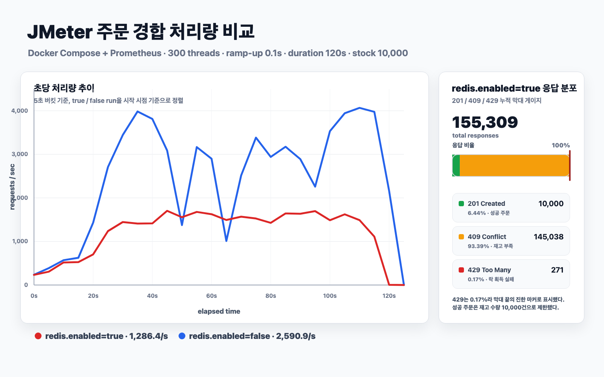
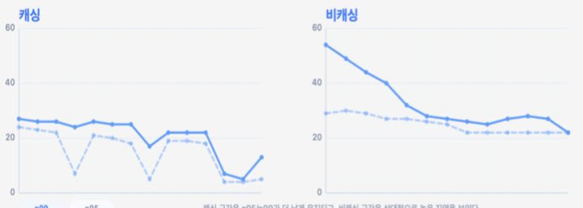

# Shopping API Server

## 1. 프로젝트 개요

이 프로젝트는 **동일 상품에 주문이 집중될 때 재고가 음수로 내려가거나 중복 차감되는 문제**를 해결하기 위해 개발한 쇼핑몰 백엔드 API 서버입니다.

기존에는 주문 요청이 동시에 들어올 때 애플리케이션 레벨 락만으로 재고 정합성을 보장하려는 접근을 먼저 고려했지만, 실제 재고 변경은 단일 상품 row에 대한 원자적 변경이므로 DB 조건부 업데이트가 더 단순하고 빠른 선택지인지 검증할 필요가 있었습니다.

이를 해결하기 위해 주문 흐름은 **상품 단위 락 추상화 + DB 조건부 재고 차감**으로 구성했습니다. Redis 락을 켤 수 있지만, 단일 애플리케이션 인스턴스와 단일 PostgreSQL writer 기준에서는 `UPDATE ... WHERE stock >= quantity`가 정합성의 핵심 보호 장치가 되도록 설계했습니다.

결과적으로 JMeter/Grafana 비교에서 Redis 락 활성 run보다 DB-only run이 더 높은 처리량과 낮은 지연 시간을 보였고, 통합 테스트에서는 `initial=100`, `requests=140` 조건에서 성공 수만큼만 재고가 차감되며 최종 재고가 음수가 되지 않음을 검증했습니다.

## 2. 문제 정의

### 문제 1: 주문 경합 시 재고 정합성

같은 상품에 주문이 몰리면 여러 요청이 동시에 현재 재고를 읽고 차감할 수 있습니다. 단순 조회 후 update 방식으로 처리하면 재고가 부족한데도 주문이 성공하거나, 최종 재고가 음수가 되는 문제가 발생할 수 있습니다.

### 문제 2: 분산 락의 필요성 판단

Redis 락은 여러 애플리케이션 인스턴스가 같은 자원을 변경할 때 유효한 선택지입니다. 하지만 이 프로젝트의 주문 차감은 단일 PostgreSQL row에 대한 조건부 update로 원자성을 확보할 수 있는 작업입니다. 이 상황에서 Redis 락을 항상 사용하는 것은 네트워크 왕복, retry/backoff, lock/unlock 비용을 추가할 수 있습니다.

### 문제 3: 조회 트래픽과 캐시 일관성

상품 목록/상세 조회는 반복 접근 가능성이 높아 Redis 캐시 적용 후보입니다. 다만 상품 생성/수정/삭제 이후 오래된 조회 결과가 남으면 판매자 변경 내용과 구매자 조회 결과가 달라질 수 있어 캐시 무효화 기준이 필요했습니다.

### 왜 문제인가

- 재고 초과 판매는 주문 취소, 환불, 고객 불만으로 이어지는 직접적인 서비스 장애입니다.
- 락 경합이 사용자 응답 지연으로 전파되면 주문 피크 시간대 처리량이 낮아질 수 있습니다.
- 분산 락을 근거 없이 적용하면 안정성 장치가 아니라 병목이 될 수 있습니다.
- 캐시 무효화가 불명확하면 읽기 성능은 좋아져도 데이터 신뢰도가 낮아집니다.

## 3. 해결 방식

### 전체 구조

```text
Client
  -> Auth / Product / Order API
  -> AuthService / ProductService / OrderService
  -> Port Interface
  -> MyBatis Repository
  -> PostgreSQL

ProductService
  -> Redis Cache

OrderService
  -> ProductLockRepository
  -> RedisLockService 또는 NoOpProductLockService
  -> ProductRepository.decreaseStockIfEnough()
```

### 핵심 설계 1: DB 조건부 재고 차감

주문 생성 시 `OrderService`는 상품별로 재고 차감을 요청하고, 실제 차감은 MyBatis mapper의 조건부 update가 담당합니다.

```sql
UPDATE products
SET stock = stock - #{quantity}
WHERE id = #{productId}
  AND stock >= #{quantity}
  AND status = 'ACTIVE'
```

이 방식은 재고 확인과 차감을 하나의 SQL로 묶습니다. update count가 0이면 재고 부족으로 판단해 `409 OUT_OF_STOCK`을 반환합니다.

### 핵심 설계 2: 교체 가능한 상품 락 포트

주문 서비스는 Redis 구현체에 직접 의존하지 않고 `ProductLockRepository` 포트를 사용합니다.

- `redis.enabled=true`: `RedisLockService`가 `SET NX PX` 방식으로 상품 단위 락을 획득하고 Lua script로 token이 일치할 때만 해제합니다.
- `redis.enabled=false`: `NoOpProductLockService`를 사용해 DB 조건부 update만으로 재고 정합성을 검증할 수 있습니다.

이 구조 덕분에 Redis 락이 필요한 환경과 DB-only 환경을 같은 주문 코드로 비교할 수 있었습니다.

### 핵심 설계 3: 상품 조회 캐시와 무효화

`ProductService`는 상품 상세와 상품 검색 결과를 Redis에 TTL 기반으로 저장합니다. 상품 생성/수정/삭제 시 상세 캐시와 검색 캐시를 무효화해 stale read 가능성을 줄였습니다. Redis 장애가 발생하면 예외를 전파하지 않고 DB fallback으로 처리해 조회 기능이 캐시에 종속되지 않도록 했습니다.

### 핵심 설계 4: 인증과 인가 경계 분리

인증은 JWT 기반 stateless 구조로 처리하고, `/api/seller/**`는 Spring Security와 method security에서 `SELLER` 권한을 요구합니다. Refresh token은 DB에 저장하고 재발급 시 기존 token 조건 매칭 후 새 token으로 회전시켜 탈취/재사용 리스크를 줄였습니다.

## 4. 설계 판단

### 동시성 제어

#### 고려한 방법

- Redis 분산 락
- DB 조건부 업데이트
- Redis 락 + DB 조건부 업데이트

#### 선택

- 기본 실행 경로: DB 조건부 업데이트
- 선택 실행 경로: Redis 락 + DB 조건부 업데이트

#### 이유

- 재고 차감은 단일 상품 row 변경이므로 DB update 조건으로 원자성을 확보할 수 있습니다.
- DB 조건부 update는 Redis lock/unlock 네트워크 왕복 없이 처리됩니다.
- Redis 락은 멀티 인스턴스, 외부 writer, 복수 자원 순서 제어가 추가될 때 다시 필요한 선택지가 될 수 있습니다.
- 현재 구조에서는 Redis 락을 기능 플래그처럼 켜고 끄며 실제 성능 차이를 검증하는 편이 설계 판단을 설명하기 좋았습니다.

### Redis 락 실패 처리

#### 고려한 방법

- Redis 장애를 주문 장애로 즉시 전파
- Redis 예외를 잡고 락 획득 실패로 처리

#### 선택

- Redis 예외를 catch하고 `tryLock()`은 `null`, `unlock()`은 `false`를 반환하도록 처리했습니다.

#### 이유

- 주문 API는 Redis 내부 예외 대신 `429 TOO_MANY_REQUESTS` 흐름으로 실패를 명시할 수 있습니다.
- 장애 상황이 애플리케이션 비정상 종료로 번지지 않습니다.
- `RedisLockServiceFailureRecoveryTest`에서 Redis down과 복구 후 lock/unlock 경로를 분리 검증했습니다.

### MyBatis 선택

#### 고려한 방법

- JPA Entity 중심 구현
- MyBatis SQL 명시 구현

#### 선택

- 주문/상품/인증 persistence는 MyBatis mapper를 사용했습니다.

#### 이유

- 재고 차감처럼 update count가 비즈니스 판단이 되는 쿼리를 명시적으로 관리하기 쉽습니다.
- 검색 조건, 정렬, 페이징 SQL을 mapper에서 직접 확인할 수 있습니다.
- 테스트에서는 H2, 런타임에서는 PostgreSQL을 사용하므로 mapper의 SQL 호환성을 통합 테스트로 확인할 수 있습니다.

### 캐시 적용

#### 고려한 방법

- DB 직접 조회만 사용
- Redis 캐시 적용

#### 선택

- 상품 상세/검색 조회에 Redis 캐시를 적용하되, Redis 미가용 시 DB fallback을 유지했습니다.

#### 이유

- 상품 조회는 주문보다 읽기 비중이 높아 캐시 후보입니다.
- 캐시 장애가 핵심 API 장애로 전파되지 않도록 optional dependency로 다뤘습니다.
- 상품 변경 시 검색 캐시 prefix를 삭제해 데이터 변경 이후 stale read 범위를 줄였습니다.

## 5. 결과

### 주문 경합 비교

측정 조건은 `loadtest/results/order-contention/compare-compose-20260429`의 JMeter 결과와 Prometheus 요약을 기준으로 정리했습니다.

| 항목 | Redis 락 활성 | DB-only | 결과 |
| --- | ---: | ---: | --- |
| Samples | 155,309 | 317,844 | DB-only가 더 많은 요청 처리 |
| Throughput | 1,270.53 req/s | 2,590.88 req/s | 약 2.0배 증가 |
| Average latency | 232.84ms | 111.86ms | 약 52% 감소 |
| P95 latency | 507ms | 352ms | 감소 |
| P99 latency | 1,119ms | 772ms | 감소 |
| HTTP 201 | 10,000 | 10,000 | 동일 재고 수량만큼 성공 |
| HTTP 409 | 145,038 | 307,844 | 재고 소진 후 빠르게 실패 반환 |
| HTTP 429 | 271 | 0 | DB-only에서는 lock-busy 미발생 |
| Redis commands/sec 평균 | 5,605.03 | 0.56 | Redis 락 비용 제거 |

<p align="center">
  
</p>

### 동시성 통합 테스트

`OrderServiceConcurrencyIntegrationTest`는 `initialStock=100`, `requestCount=140`, `threadCount=32` 조건으로 동시에 주문을 생성합니다.

- 성공 주문 수는 초기 재고 이하로 제한됩니다.
- 최종 재고는 `initialStock - success`와 일치합니다.
- 최종 재고는 항상 `0` 이상이어야 합니다.
- 테스트 출력 예시 기준: `success=100`, `rejected=40`, `finalStock=0`

### 상품 캐시 검증

`product-cache.jmx`는 hot page와 random page를 섞어 상품 목록 조회 지연을 관측합니다. 현재 `result.jtl`은 여러 실행이 누적된 파일이라 전체 wall-clock 기반 throughput은 README 수치로 사용하지 않았습니다. 대신 응답 지연과 성공 여부만 참고했습니다.

| 항목 | Samples | 응답 코드 | Avg | P95 | P99 |
| --- | ---: | --- | ---: | ---: | ---: |
| Product detail | 4,947 | 200 | 10.03ms | 20ms | 33ms |
| Hot page list | 11,948 | 200 | 13.00ms | 27ms | 39ms |
| Random page list | 9,977 | 200 | 13.19ms | 28ms | 40ms |

<p align="center">
  
</p>

## 6. 트러블슈팅

### 문제: 주문 동시 처리 시 재고 충돌

### 원인

동일 상품 주문이 동시에 들어오면 재고 확인과 차감 사이에 경쟁 조건이 생길 수 있습니다. Redis 락을 적용해도 실제 재고 감소가 원자적으로 보장되지 않으면 락 실패/해제 누락/재시도 상황에서 정합성 위험이 남습니다.

### 해결

재고 차감은 DB 조건부 update로 처리하고, update count가 0이면 `409 OUT_OF_STOCK`으로 반환했습니다. Redis 락은 `ProductLockRepository` 포트 뒤에 두어 필요할 때만 활성화할 수 있게 했습니다.

### 결과

동시성 통합 테스트에서 요청 140건 중 초기 재고 100개만 주문 성공하고 최종 재고가 0으로 유지되었습니다. JMeter 비교에서도 DB-only 경로가 Redis 락 활성 경로보다 낮은 평균/P95/P99 지연을 보였습니다.

### 문제: Redis 장애 시 주문 잠금 실패

### 원인

Redis 락을 주문 경로의 선행 조건으로 두면 Redis 연결 장애가 주문 API 장애로 이어질 수 있습니다.

### 해결

`RedisLockService`에서 Redis 예외를 catch해 락 획득 실패로 처리하고, 실패 요청은 `429 TOO_MANY_REQUESTS`로 응답하도록 했습니다. 복구 후에는 lock/unlock이 다시 성공하는지 Testcontainers 기반 테스트로 확인했습니다.

### 결과

Redis 장애가 애플리케이션 종료로 이어지지 않고, 주문 실패 원인이 API 응답 코드와 로그로 관측 가능해졌습니다.

### 문제: Refresh token 재사용

### 원인

Refresh token을 stateless JWT만으로 검증하면 유출된 과거 token의 재사용을 제어하기 어렵습니다.

### 해결

Refresh token을 DB에 저장하고, 재발급 요청 시 기존 token 값과 만료 시간, revoked 상태를 조건으로 새 token으로 회전했습니다.

### 결과

최신 refresh token만 재발급에 사용할 수 있고, token type이 `refresh`가 아니면 JWT 파싱 단계에서 거부됩니다.

## 7. 기술 스택

| 영역 | 기술 | 역할 |
| --- | --- | --- |
| Backend | Java 21, Spring Boot 4.0.2 | REST API 서버 |
| Security | Spring Security, JWT(jjwt), BCrypt | 인증, 인가, 토큰 발급/검증 |
| Database | PostgreSQL 16 | 사용자, 상품, 주문 데이터 저장 |
| Persistence | MyBatis 4.0.1 | SQL mapper, 조건부 update, 조회 쿼리 |
| Cache/Lock | Redis 7, Spring Data Redis, Lettuce | 상품 조회 캐시, 선택적 상품 단위 락 |
| Migration | Flyway | DB schema versioning |
| Observability | Actuator, Micrometer, Prometheus, Grafana | API/Redis 지표 수집과 대시보드 |
| Test | JUnit 5, AssertJ, H2, Testcontainers | 서비스/mapper/Redis 통합 검증 |
| Infra | Docker, Docker Compose | 로컬 실행 환경 구성 |
| Load Test | JMeter | 주문 경합, 상품 캐시 시나리오 측정 |

## 8. 실행 방법

### Docker Compose 실행

```bash
git clone git@github.com:hyosikKim98/shoppingmall.git
cd shoppingmall
docker compose up -d --build
```

기본 접속 정보:

- API: `http://localhost:8080`
- PostgreSQL: `localhost:5432`, database/user/password = `shop/shop/shop`
- Redis: `localhost:6379`
- Prometheus: `http://localhost:9090`
- Grafana: `http://localhost:3000` (`admin` / `admin`)

### 로컬 실행

PostgreSQL과 Redis를 먼저 실행한 뒤 애플리케이션을 실행합니다.

```bash
./gradlew bootRun
```

주요 설정은 `src/main/resources/application.yml`에서 확인할 수 있습니다.

- `spring.datasource.url`
- `spring.datasource.username`
- `spring.datasource.password`
- `redis.enabled`
- `redis.cache.product.enabled`
- `redis.lock.ttl.ms`
- `jwt.secret`
- `jwt.access.expiration`
- `jwt.refresh.expiration`

### 테스트

```bash
./gradlew test
```

### JMeter 주문 경합 테스트

기본 JMeter plan은 `user@example.com / 1234` 계정과 주문 가능한 `productId`가 준비되어 있다는 전제로 실행됩니다. `docker-compose.yml`의 기본값은 `SEED_BULK_ENABLED=false`이므로, 성능 테스트 전에는 `/api/auth/signup`과 판매자 상품 등록 API로 테스트 데이터를 만들거나 seed 설정을 켜서 데이터를 준비해야 합니다.

```bash
jmeter -n \
  -t loadtest/jmeter/order-contention.jmx \
  -l loadtest/results/order-contention/result.jtl \
  -e -o loadtest/results/order-contention/html \
  -Jscheme=http \
  -Jhost=localhost \
  -Jport=8080 \
  -JcustomerEmail=user@example.com \
  -JcustomerPassword=1234 \
  -JproductId=1 \
  -JorderQuantity=1 \
  -Jthreads=150 \
  -JrampUp=30 \
  -Jduration=180
```

## 9. 프로젝트 구조

```text
src
├── main
│   ├── java/project/shopping
│   │   ├── common
│   │   │   ├── config
│   │   │   ├── exception
│   │   │   ├── response
│   │   │   └── security
│   │   ├── domain
│   │   │   ├── order
│   │   │   ├── product
│   │   │   └── user
│   │   └── infrastructure
│   │       └── persistence
│   │           ├── lock
│   │           ├── mybatis
│   │           └── redis
│   └── resources
│       ├── db/migration
│       └── mybatis/mapper
└── test
    └── java/project/shopping
        ├── domain
        └── infrastructure
```

주요 문서:

- [Architecture](docs/architecture.md)
- [API Guide](docs/api/README.md)
- [OpenAPI Spec](docs/api/openapi.yaml)
- [ERD](docs/erd.md)
- [Performance Test Guide](docs/performance.md)
- [Troubleshooting](docs/troubleshooting.md)

## 10. 개선 방향

- 주문 생성에서 여러 상품을 동시에 주문할 때 상품 ID 정렬 기반으로 락 순서를 고정해 교착 가능성을 더 명확히 제거
- 캐시 무효화에 `keys product-search:*` 대신 cache index 또는 versioned key를 적용해 운영 Redis에서 scan 비용 축소
- 상품 목록 캐시 ON/OFF를 동일 조건으로 재측정하고 JTL이 누적되지 않도록 run별 결과 디렉터리 분리
- Redis 락이 필요한 멀티 인스턴스 조건을 별도 Compose scale 환경에서 재검증
- 주문/결제/재고 차감이 분리되는 구조로 확장할 경우 outbox 또는 message queue 기반 이벤트 처리 검토
- `refresh_tokens`에 사용자 외래키와 만료 token 정리 job을 추가해 장기 운영 시 데이터 정합성 강화
