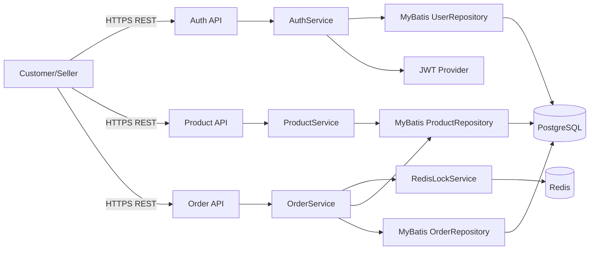

# Architecture

## 핵심 요청 흐름

- 로그인/회원가입 요청은 `AuthController`로 진입한다.
- `AuthService`는 사용자 검증 후 access/refresh JWT를 발급한다.
- refresh 토큰은 `MyBatisUserRepository`를 통해 `refresh_tokens`에 저장/회전된다.
- 주문 생성 요청은 `OrderController`에서 `OrderService.create`로 전달된다.
- `OrderService`는 상품별로 `RedisLockService`에서 락을 획득한다.
- 락 획득 후 `ProductRepository.decreaseStockIfEnough`로 조건부 차감한다.
- 주문/주문아이템은 `OrderRepository`로 저장한다.
- 주문 취소 시 주문 상태를 `CANCELED`로 변경하고 재고를 복구한다.

## 설계 포인트

- 인증 경계: `/api/auth/**`는 공개, `/api/seller/**`는 SELLER Role 강제.
- 트랜잭션 경계: 주문 생성/취소는 서비스 단위 트랜잭션으로 처리.
- 동시성 제어: 주문 생성 시 상품 단위 Redis 락 + DB 조건부 재고 차감 조합.
- 토큰 보안: JWT에 토큰 타입(access/refresh)을 분리해 검증.
- 토큰 회전: refresh 재발급 시 기존 토큰 조건 매칭 후 교체.

## 운영 포인트

- 로깅/추적: `TraceIdUtil` + MDC로 요청 추적 ID 유지.
- 장애 관측: Redis 락 획득 실패는 429로 반환되어 API 레벨에서 탐지 가능.
- 무결성: 재고 차감/복구는 DB update 쿼리로 강제되어 상태 불일치 가능성을 낮춤.
