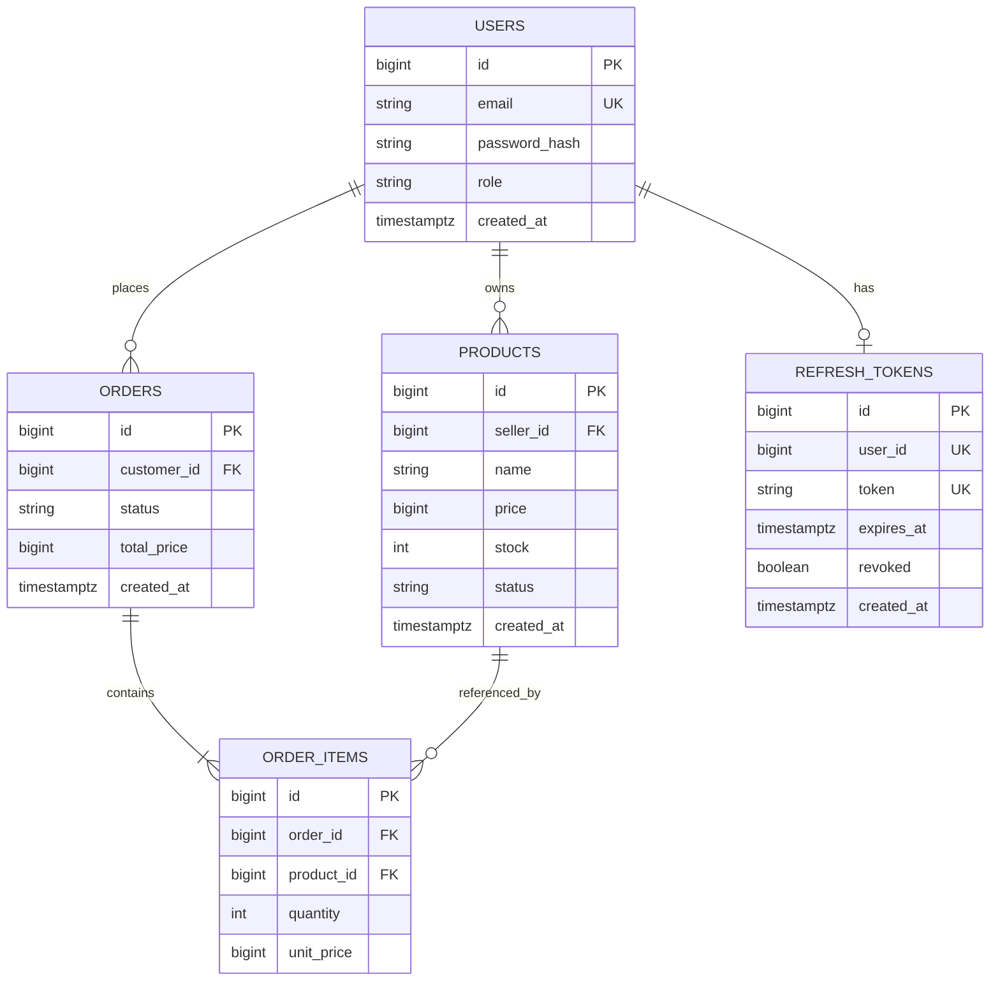

# ERD

## 테이블별 역할

- `users`: 인증 대상 사용자 정보(이메일/비밀번호 해시/역할).
- `products`: 판매자 소유 상품과 재고/상태.
- `orders`: 고객 주문 헤더(상태, 총액).
- `order_items`: 주문 상세 라인(상품, 수량, 단가).
- `refresh_tokens`: 사용자별 refresh 토큰 1개 보관 및 로테이션.

## 운영 포인트

- 유니크 제약
- `users.email` 유니크 조회 전제 (`UserMapper.existsByEmail`).
- `refresh_tokens.user_id`, `refresh_tokens.token` 유니크 전제 (`UserMapper.xml`의 upsert/rotate 쿼리).

- 인덱스 TODO
- TODO: `orders.customer_id`, `order_items.order_id`, `products.seller_id` 인덱스 여부 확인 필요.
  근거: `/Users/hyosik981010/Desktop/study/shopping/src/main/resources/mybatis/mapper/OrderMapper.xml`, `/Users/hyosik981010/Desktop/study/shopping/src/main/resources/mybatis/mapper/ProductMapper.xml`

- 운영 DDL TODO
- TODO: `refresh_tokens` 테이블의 운영(PostgreSQL) DDL 위치 확인 필요.
  근거: `/Users/hyosik981010/Desktop/study/shopping/src/main/resources/mybatis/mapper/UserMapper.xml`에는 사용 쿼리가 있으나 운영 마이그레이션 파일은 레포에서 확인되지 않음.
